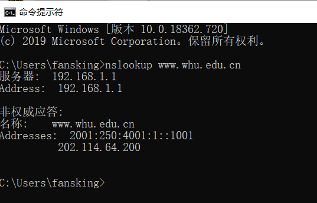

## 第四次作业

### nslookup

nslookup是一种网络管理命令行工具，可用于查询DNS域名和IP地址输入指令nslookup默认服务器和Address是当前上网所用的DNS服务器域名和地址A记录A（Address）记录指的是用来指定主机名或域名对应的IP记录。



### 课后题目

#### P11

a) 是的，因为Bob连接数更多，他可以获得更大的链路带宽。

B)是的，不然 bob将获得比其他四个用户更少的带宽。

#### P12

Server.py 

```python
from socket import * 
serverPort=12000 
serverSocket=socket(AF_INET,SOCK_STREAM) 
serverSocket.bind(('',serverPort)) 
serverSocket.listen(1) 
connectionSocket, addr = serverSocket.accept() 
while 1: 
	sentence = connectionSocket.recv(1024) 
	print(sentence)
serverSocket.close() 
```

#### P13

MAIL FROM: 信封上的发件人, 由「前缀@域名」组成. 此域名就是所谓的发信域名

from :信件内容里的发件人. 用户可以任意填写, 支持别名显示.