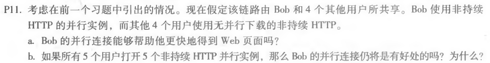

### 第四次作业

* * *

#### nslookup www.whu.edu.cn

　　NSLOOKUP是查询域名信息的一个非常有用的命令，可以指定查询的类型，可以查到DNS记录的生存时间还可以指定使用哪个DNS服务器进行解释。主要用来诊断域名系统 (DNS) 基础结构的信息。

* * *

#### P11

##### 题目：

##### 作答：
a.能。因为bob拥有更多的连接，所以他可以获得更大的链路带宽份额。

b.仍将是有好处的。如果他不继续执行并行下载，他获得的带宽将比另外四个用户更少。

* * *

#### P14

##### 题目：

##### 作答：
SMTP使用仅包含句点“`.`”的行来标记邮件正文的结束。

http使用“`content-length`”字段来表示消息正文的长度。

二者不能使用相同的方法。因为HTTP消息可以是二进制数据，而在SMTP中，消息主体必须是7位的ASCII格式。

* * *

#### P20

##### 题目：

##### 作答：
我们可以定期拍摄本地DNS服务器中DNS缓存的快照。

该组织在DNS缓存中出现最频繁的Web服务器就是最流行的服务器。

这是因为如果更多的用户对Web服务器感兴趣，那么DNS请求就会对此感兴趣服务器更频繁地由用户发送。

* * *
