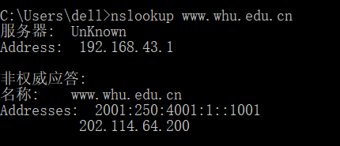
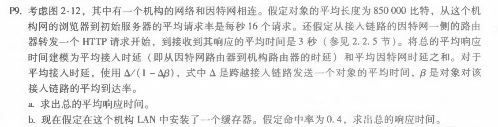
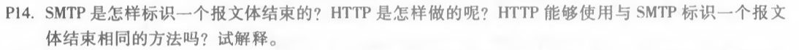
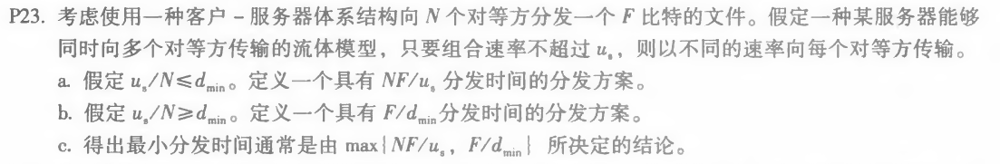

# 网络及分布式计算第四次作业

计算机学院-刁可 -2017302580031

1. nslookup www.whu.edu.cn

   nslookup用于查询DNS的记录，查询域名解析是否正常，在网络故障时用来诊断网络问题

   

   以上结果显示，正在工作的 DNS 服务器的主机名unknown，它的IP地址是192.168.43.1，而域名www.whu.edu.cn所对应的IPv6地址为2001:250:4001:1::1001，IPv4地址为202.114.64.200。

2.  P9

   

   a. 

   首先计算发送一个对象的平均时间：
   (850,000 bits)/(15,000,000 bits/sec) = 0.0567 sec
   平均到达率：
   (16 requests/sec)(0.0567 sec/request) = 0.907.
   平均接入延迟：
   (0.0567 sec)/(1 - 0.907)=0.6 sec
   平均响应时间：
   0.6 sec + 3 sec = 3.6 sec.

   b.

   当有缓存器的时候，流量强度强度减少了40％。

   平均接入延迟：
   (0.0567 sec)/[1 – (0.6)(0.907)] = 0.12 sec

   如果请求由缓存器满足的话，其响应时间近似为 0 sec。
   当缓存器未命中时，缓存丢失的平均响应时间是 0.12 sec + 3 sec = 3.12 sec
   因此平均响应时间是：(0.4)(0 sec) + (0.6)(3.12 sec) = 1.872 sec
   因此总的响应时间减少到 1.872 sec

3. P14

   

   SMTP使用仅包含句号的行来标记消息主体的结束。HTTP使用“Content-Length header字段”表示消息体的长度。

   HTTP不能使用SMTP使用的方法，因为HTTP消息可以是二进制数据，而在SMTP中，消息体必须是7位ASCII格式，并且报文内容可能含有句号。

4. P23

   

   a.
   服务器向N个用户同时并行分发，速率为 us/N，因为 us/N <= dmin，所以客户端也以该速率下载。则每个客户端接收完文件的时间为 F / (us / N) = NF / us

   b.
   服务器向N个用户同时以dmin速度并行分发，dmin 为速率，因为 us/N >= dmin，所以 us >= Ndmin，故服务器可以承受此速率，各服务器以 dmin 为下载速率，故接收时间为 F/dmin

   c.
   当 us/N <= dmin 时：
           N/us >= 1/dmin
           NF/us >= F/dmin
           此时 t = NF/us = max{NF/us, F/dmin}
   当 us/N >= dmin 时：
           N/us <= 1/dmin
           NF/us <= F/dmin
           此时 t = F/dmin = max{NF/us, F/dmin}

   因此：得出最小分发时间为 max{NF/us，F/dmin}
