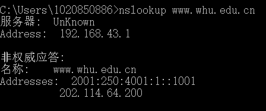
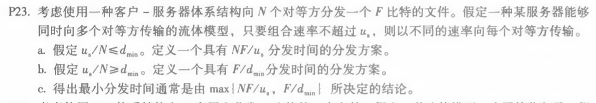

### nslookup

#### 作用：

nslookup用于查询DNS的记录，查询域名解析是否正常，在网络故障时用来诊断网络问题

#### nslookup www.whu.edu.cn

### 课后习题：

#### P22

##### 答：

###### 客户服务器

|  N   |    t    |
| :--: | :-----: |
|  10  |  7500s  |
| 100  | 50000s  |
| 1000 | 500000s |

###### P2P

| t      | N    | 10    | 100    | 1000     |
| ------ | ---- | ----- | ------ | -------- |
| u      |      |       |        |          |
| 300kps |      | 7500s | 25000s | 45454.5s |
| 700kps |      | 7500s | 15000s | 20547.9s |
| 2Mbps  |      | 7500s | 7500s  | 7500s    |

#### P23

##### 答：

###### a.

服务器向每个客户端并行发送文件，此速率为 us/N，因为 us/N <= dmin，所以客户端也以该速率下载。

每个客户端接收完文件的时间为 F / (us / N) = NF / us

###### b.

仍然考虑服务器向每个客户端并行发送文件，以 dmin 为速率

因为 us/N >= dmin，所以 us >= Ndmin，故服务器可以承受此速率

各服务器以 dmin 为下载速率，接收时间为 F/dmin

###### c.

当 us/N <= dmin 时：N/us >= 1/dmin,NF/us >= F/dmin, 

t = NF/us = max{NF/us, F/dmin}
当 us/N >= dmin 时：N/us <= 1/dmin,NF/us <= F/dmin.
 t = F/dmin = max{NF/us, F/dmin}

因此：得出最小分发时间为 max{NF/us，F/dmin}

#### P25

##### 答：

有N个节点。N(N-1)/2条边。