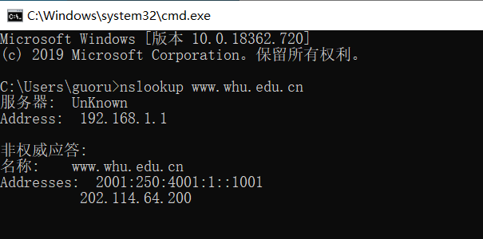
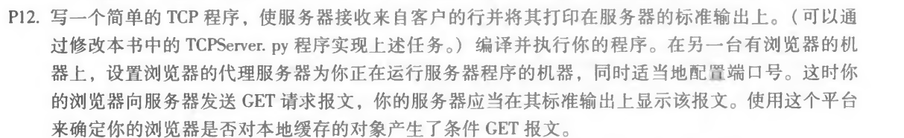
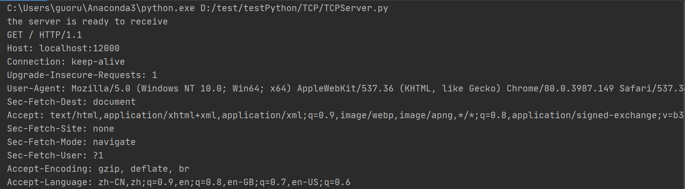
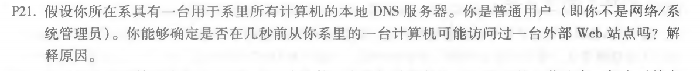
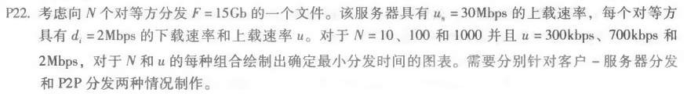

# Table of Contents

  * [第四次作业](#第四次作业)
    * [一、nslookup www.whu.edu.cn](#一nslookup-wwwwhueducn)
    * [二、p12](#二p12)
    * [三、p21](#三p21)
    * [四、p22](#四p22)


## 第四次作业


### 一、nslookup www.whu.edu.cn

​	使用命令：

```
nslookup www.whu.edu.cn
```

​	结果如下：




### 二、p12



```python
from socket import *
serverPort = 12000
# 创建TCP套接字
serverSocket = socket(AF_INET, SOCK_STREAM)
# 关联端口
serverSocket.bind(('', serverPort))
# 监听
serverSocket.listen(1)
print('the server is ready to receive')
while True:
    # 创建由特定客户专用的套接字
    connectionSocket, addr = serverSocket.accept()
    # 客户端的请求
    sentence = connectionSocket.recv(1024).decode()
    # 输出请求到标准输出
    print(sentence)
    # 关闭连接
    serverSocket.close()
```

浏览器请求```localhost:12000```，服务器结果如下：




### 三、p21



```
是的，我们可以在本地DNS服务器中使用DIG查询该网站。如果外部web网站几秒钟前刚刚被访问，那么网站的条目将缓存在本地DNS缓存中，因此查询时间为0毫秒。否则，查询时间很长。
```


### 四、p22



客户端-服务器最小分发时间：

```
t(c-s)min = max{ NF/us, F/min(di) }
```

p2p分发的最小时间：

```
t(p2p)min = max{ F/us, F/min(di), NF/(us+sum(ui))}
```

F = 15Gb = 15 * 1024Mbit

us = 30Mbps

min(di) = di = 2Mbps

客户端-服务器：

|      | 300kbps | 700kbps | 2Mbps   |
| ---- | ------- | ------- | ------- |
| 10   | 7680s   | 7680s   | 7680s   |
| 100  | 51200s  | 51200s  | 51200s  |
| 1000 | 512000s | 512000s | 512000s |

P2P

|      | 300kbps | 700kbps | 2Mbps |
| ---- | ------- | ------- | ----- |
| 10   | 7680s   | 7680s   | 7680s |
| 100  | 25906s  | 15617s  | 7680s |
| 1000 | 47559s  | 21524s  | 7680s |

