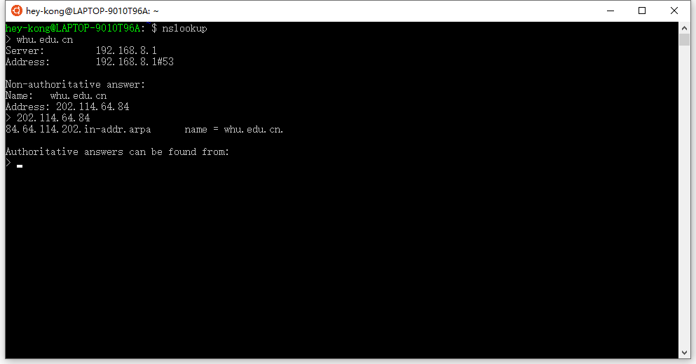
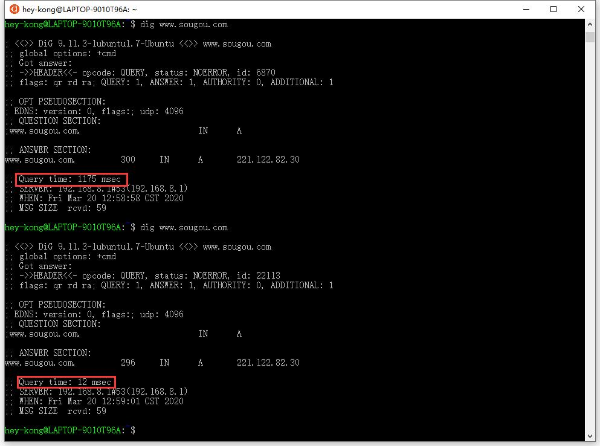

## 分布式与网络课程作业四

### nslookup whu.edu.cn:

whu.edu.cn 的 IP 地址为 202.114.64.84。

### P21:
能。可以使用 dig 命令查询，`dig XXX.com` 将返回查找 `XXX.com` 的查询时间。如果 `XXX.com` 不久前刚刚被访问，那么它将缓存在本地 DNS 缓存中，查询时间只会有几毫秒。否则，查询时间很长。例如：

一开始查询 `www.sougou.com` 用了 1.175 s，之后它就会被缓存，再次查找时只需要 12 ms。

### P28:
a) 会报错： `socket.error: [Errno 111] Connection refused` 。因为 Client 尝试连接的 Server 进程不存在，会连接失败。

b) 会正常工作。因为 UDP 不是面向连接的，Client 发送数据前不需要与 Server 建立连接。

c) 同样会报错： `socket.error: [Errno 111] Connection refused` 。因为应用程序与监听的端口号是对应的，如果使用不同的端口号，会使 Client 尝试连接错误的 Server 进程或是不存在的 Server 进程。

### P31:
优点： 如果应用程序要发送的一条消息数据量很大，超过了 UDP 包的最大长度，这时就无法用一个完整的报文进行传输，如果还是采用 UDP 协议进行传输的话，就需要把消息分包发送，而对于接收端来说，接收到的报文不一定是按序到达的，接收端的应用程序解析这条消息会很麻烦；而使用面向字节流的 TCP 协议发送的话，可以保证接收端收到的数据不乱序。

缺点： 会产生粘包问题，发送端发送的若干包数据到接收端接收时粘成一包，从接收缓冲区看，后一包数据的头紧接着前一包数据的尾。解决粘包问题需要应用程序对数据进行处理，例如用特殊标识符标记数据段的尾部作为边界，或者在数据段的头部加上长度来表示完整数据段的长度，以便应用程序的接收方能够区分一条消息和另一条消息。
