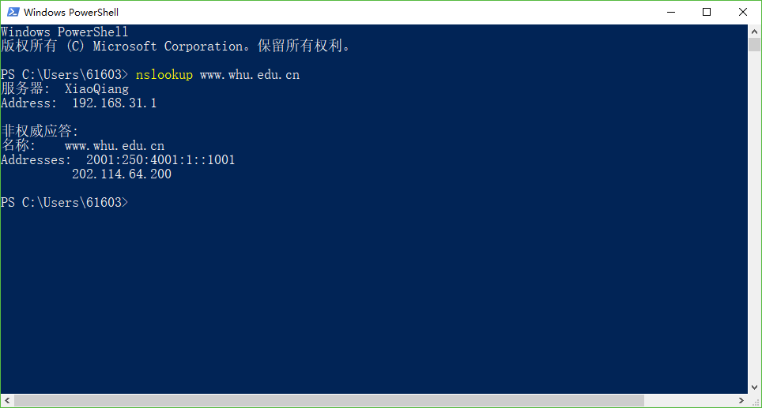

### NetworkDistribution_Homework4.  

### nslookup
	nalookup命令用于查询DNS的记录，查看域名解析是否正常，在网络故障的时候用来诊断网络问题。nslookup的用法相主要是下面的几个：直接查询，查询其他记录，查询更具体的信息。  

#### 课后题目  
#### P11 题目：
  
a.是的，因为Bob有更多的连接，他可以获得更大的链路带宽份额。  
b.是的，Bob仍然需要执行并行下载；否则，他将获得比其他四个用户更少的带宽。  
****
#### P12 题目：
  
Server.py  
		from socket import *   
		serverPort=12000    
		serverSocket=socket(AF_INET,SOCK_STREAM)   
		serverSocket.bind(('',serverPort))   
		serverSocket.listen(1)   
		connectionSocket, addr = serverSocket.accept()   
		while 1:   
		sentence = connectionSocket.recv(1024)   
		print 'From Server:', sentence, '\n'   
		serverSocket.close()   
****
#### P13 题目：

MAIL FROM:inSMTP的邮件是从SMTP客户端发送的标识发件人的邮件将邮件消息发送到SMTP服务器。  
FROM：在邮件消息本身不是SMTP邮件，而不是邮件正文中的一行。
****
### author：2017302580217_董娜
