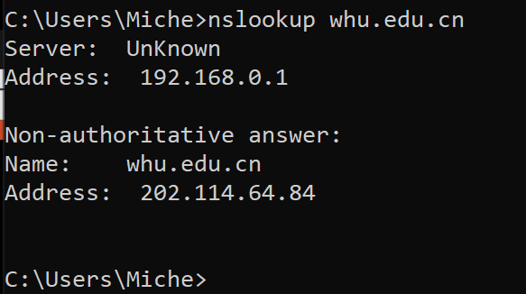
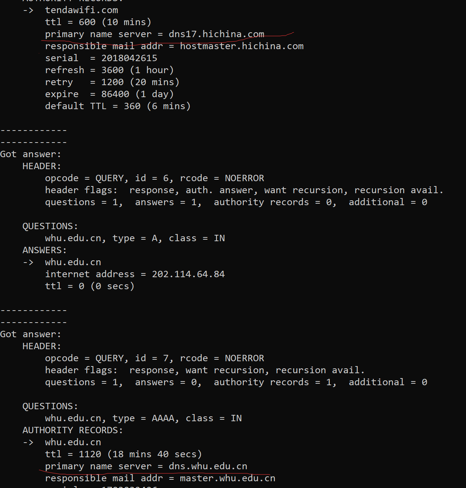

## HomeWork 4

### 一. nslookup 

> nslookup命令用于查询DNS的记录，查看域名解析是否正常，在网络故障的时候用来诊断网络问题

1. 在 cmd 命令行界面输入 `nslookup whu.edu.cn`命令，返回结果如下：

   

2. 输入`nslookup -d whu.edu.cn` 即加上 -d 参数可以看到更多更具体的缓存信息。如我用的路由器是tenda的，会先经过dns17.hichina.com域名服务器，最后才到 dns.whu.edu.cn域名服务器，拿到域名对应的 IP地址。

   

### 二. 课后习题

#### P7

答：获得包含对象的服务器的IP地址之前，需要得到前面所有DNS服务器的响应，所需时间为访问所有DNS服务器产生的 RTT之和；得到正确的 IP地址后，需要先进行TCP连接再发送HTTP请求，这时需要时间为 2 * $RTT_{0}$，故总的时长为 $T_{total} = 2 * RTT_{0} + RTT_{1} + ··· +RTT_{n}$

#### P8

答：

- a）没有并行TCP连接的非持续HTTP下，请求到Web页面之后，需要对于每个引用的对象都建立独立的TCP连接并进行相应的HTTP请求，需要时间为 $2 * RTT_{0} + 8 * 2 * RTT_{0} = 18 * RTT_{0}$, 总时长为 $18 * RTT_{0} + RTT_{1} + ··· +RTT_{n}$
- b）在配置有5个并行连接的条件下，8个引用对象需要2次独立的连接和请求才能得到。总时长为 $2 * RTT_{0} + 2 * 2 * RTT_{0} + RTT_{1} + ··· +RTT_{n} = 6 * RTT_{0} + RTT_{1} + ··· +RTT_{n}$
- c）分两种情况讨论，当连接是并行的情况下，8个对象同时请求，总时长为 $2 * RTT_{0} + RTT_{0} + RTT_{1} + ··· +RTT_{n} = 3 * RTT_{0} + RTT_{1} + ··· +RTT_{n}$；当连接不并行，则需要分别请求8个引用对象，总时长为 $2 * RTT_{0} + 8*RTT_{0} + RTT_{1} + ··· +RTT_{n} = 10 * RTT_{0} + RTT_{1} + ··· +RTT_{n}$

#### P23

答：

- a) 由于 $u_{s}/N \leq d_{min}$, 服务器向N个对等方并行发送文件，速率为 $u_{s}/N$，小于对等方下载文件的速率，故文件可以及时下载，所需的总分发时间为 $NF/u_{s}$
- b) 由于$u_{s}/N \geq d_{min}$, 服务器向N个对等方并行发送文件，发送文件的速率大于对等方最小的下载速率，故分发时间的瓶颈在于拥有最小下载速率的对等方，所需的分发时间即为最小下载速率的对等方的下载时间 $F/d_{min}$，此时其他的对等方都已下载完毕
- c)上面的 a和b分别说明了两种情况下所需的分发时间，$u_{s}/N \leq d_{min}$和$u_{s}/N \geq d_{min}$涵盖了所有的情况，根据这个条件的不同得到不同的分发时间的结果。当满足$u_{s}/N \leq d_{min}$条件时， $NF/u_{s} \geq F/d_{min}$，取较大者。满足另一条件时也类似，故最小分发时间为 max{ $NF/u_{s}$,$F/d_{min}$}

#### P24

答：

- a)先定义 $u = u_{1} + u_{2}+ ···+u_{N}$。在$u_s\leq(u_s+u)/N$ 条件下，服务器的文件分为N个部分，第i部分大小为$u_{i}F/u$,服务器传输第i部分给第i个对等方的速率为$r_{i}=u_{i}u_{s}/u$, 可以得到 $u_{s} = r_{1}+···+r_{N}$。同时每个对等方都以速率 $r_{i}$ 向其他N-1个对等方发送比特，转发速率为 $(N - 1)r_{i}$，则$(N-1)r_i=(N-1)(u_su_i)/u<=u_i$。对等点以合计速率$r_{i}+\sum_{j<>i}{r_j}=u_s$接收比特，接收时间为$F/u_s$。
- b))先定义 $u = u_{1} + u_{2}+ ···+u_{N}$,。在$u_s\geq(u_s+u)/N$ 条件下, 服务器的文件分为N+1个部分，给第i 个对等方的速率为 $r_{i}$，同时以速率$r_{N}$发送第N+1部分的文件给N个对等方中的每一个，对等方不转发这第N+1的部分。可得服务器的聚合发送速率为$r_{1}+…+r_{N}+Nr_{N+1}=u/(N-1)+u_{s}–u/(N-1)=u_{s}$。对等点最大的总发送速率为$(N-1)r_i=u_i$，对等方接收比特的合计速率为$r_{i}+r_{N+1}+\sum_{j<>i}{r_{j}}=u/(N-1)+(u_s-u/(N-1))/N=(u_s+u)/N$，故分发时间为$NF/u_{s}+u$。
- c)综合上面的 a和b，可以得到一般情况下分发时间为$D\geq max\{F/u_s，NF/(u_s+u)\}$