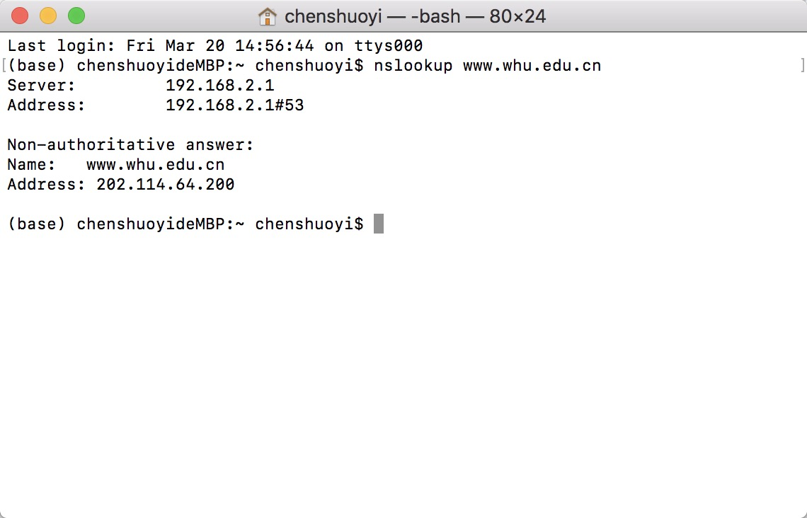
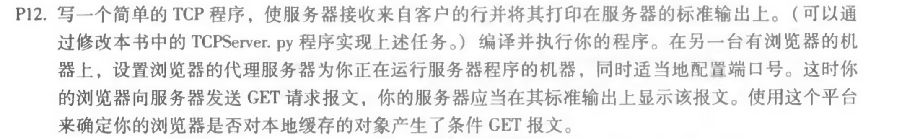
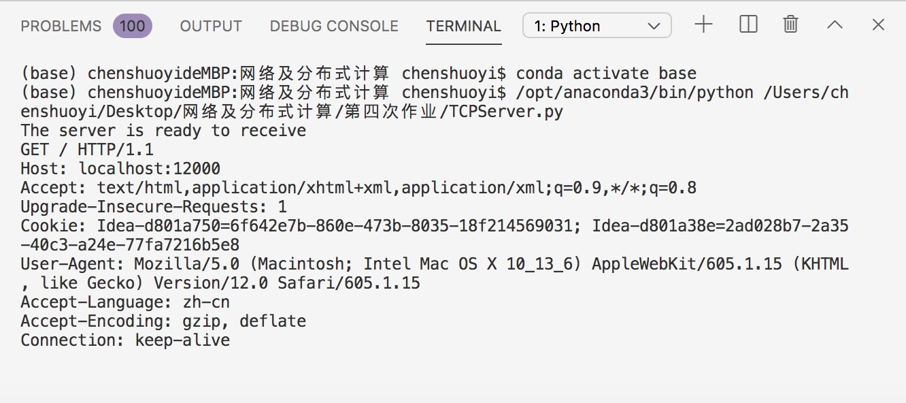
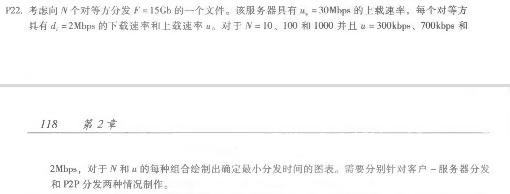
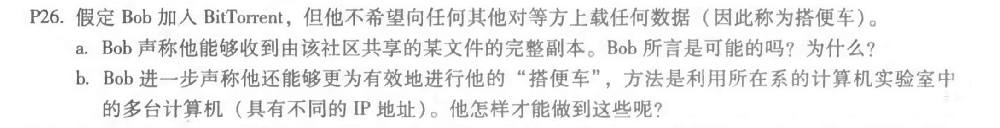

## nslookup www.whu.edu.cn



## 第二章习题



```python
from socket import *
serverPort = 12000
serverSocket = socket(AF_INET,SOCK_STREAM)
serverSocket.bind(('',serverPort))
serverSocket.listen(1)
print('The server is ready to receive')
while True:
    connectionSocket,addr = serverSocket.accept()
    sentence = connectionSocket.recv(1024).decode()
    print(sentence)

```

浏览器发送请求

```
localhost:12000
```

标准输出






1.客户-服务器

服务器传输：

发送 *N* 个拷贝的时间: (N*F)/us

客户：

客户完成下载的时间：F/di

分发 *F* 到 *N* 客户时客户-服务器需要的时间：D = max{(N*F)/us , F/di }

| N    | (N*F)/us | F/di  | D       |
| :--- | -------- | ----- | ------- |
| 10   | 5120s    | 7680s | 7680s   |
| 100  | 51200s   | 7680s | 51200s  |
| 1000 | 512000s  | 7680s | 512000s |

2.P2P

服务器传输: 

最少上载一份拷贝发送一份拷贝需要的时间: F/us

客户：

客户下载时间: F/di

上载速率 (极限最大下载速率)为:us + sum(u)

分发 *F* 到 *N* 客户时P2P 需要的时间 : D = max{F/us , F/di , NF/(us + sum(u))}

| N    | u = 300kbps | u = 700kbps | u = 2Mbps |
| ---- | ----------- | ----------- | --------- |
| 10   | 7680s       | 7680s       | 7680s     |
| 100  | 25903s      | 15616s      | 7680s     |
| 1000 | 51897s      | 22371s      | 7680s     |




a. 是可能的，对等方加入洪流，没有任何块, 但随着时间的推移从其它对等方处逐渐积累，注册到追踪器而得到对等方清单, 连接到对等方的一个子集("邻居")。

b. 他可以在每个主机上运行客户端，让每个客户端“搭便车”，并将收集的文件块从不同的主机合并为单个文件。