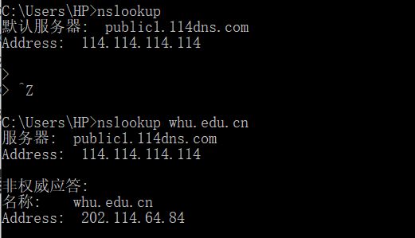
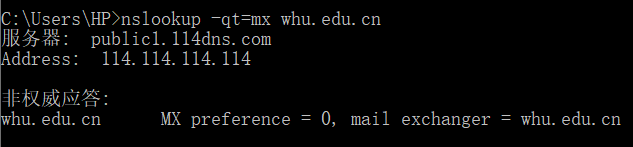

<h1>Homework4</h1>

## 1.nslookup www.whu.edu.cn

nslookup命令用来查询DNS记录，查看域名解析是否正常，在网络故障的时候用来诊断网络问题。

### 1.1直接查询

直接查询命令格式如下：nslookup domain [dns-server].如果没有指定dns-server，则使用系统默认的dns服务器。

### 1.2查询其他记录

查询时可以指定参数，查询其他记录，命令格式如下：nslookup -qt=type domain [dns-server].

### 1.3查询具体信息

查询时，加上-d参数，即可查询域名的缓存：nslookup –d [其他参数] domain [dns-server].

## 2.p14

SMTP使用仅包含“.”富豪的行来标记邮件正文的结束。HTTP使用内容长度标题字段来表示消息正文的长度。

HTTP不能使用与SMTP标识一个报文结束相同的方法。因为HTTP消息数据以二进制形式表示，而在SMTP中，消息主题必须是7位的ASCII格式。

## 3.p25

假定该TCP连接通过总共M台路由器，则在对应的覆盖网络中，有N个节点，N(N-1)/2条边

## 4.p27

### a

题目描述可知是生成音频和视频混合文件，因此服务器需要存储N个文件。

### b

如果该服务器分别发送音频流和视频流并且与客户同步这些流，该服务器需要存储2N个文件。

#### 

