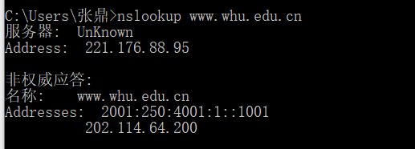

nslookup www.whu.edu.cn

P10

并行非持续连接

时间为(200b / 150bps) * 3 + ((10^5)b/ 150bps) + (200b / (150bps / 10)) * 3 + ((10^5)b / (150bps / 10)) = 7377.3s

持续连接

时间为(200b / 150bps) * 3 + ((10^5)b / 150bps) + 10 * (200b/150bps + (10^5)b/150bps) = 7351s

持续连接的时间比非持续连接快了26.3s

P23

a.
服务器向每个客户端并行发送文件，速率为 U*s*/N<= dmin, 客户端也可以以U*s*/N速率下载，每个客户端接收完文件的时间为 F / (U*s* / N) = NF / U*s*

b.

服务器向每个客户端并行发送文件，因为 U*s*/N >= dmin，服务器以 dmin 为下载速率，故接收时间为 F/dmin

c.
当U*s*/N <= dmin 时：
        N/U*s* >= 1/dmin
        NF/U*s* >= F/dmin

​        最小分发时间为NF/U*s*
当 U*s*/N >= dmin 时：
​        N/U*s*<= 1/dmin
​        NF/U*s* <= F/dmin

​         最小分发时间为F/dmin

​        因此 t = max{NF/U*s*, F/dmin}

P25

N个节点，N*（N-1）/2条边

