# 网络及分布式计算作业（四）

[toc]

## nslook测试

+ 

## 课后习题-截图

### P9

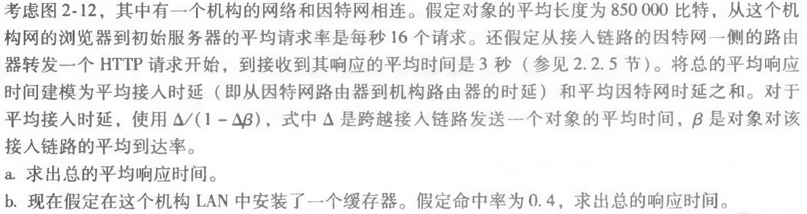

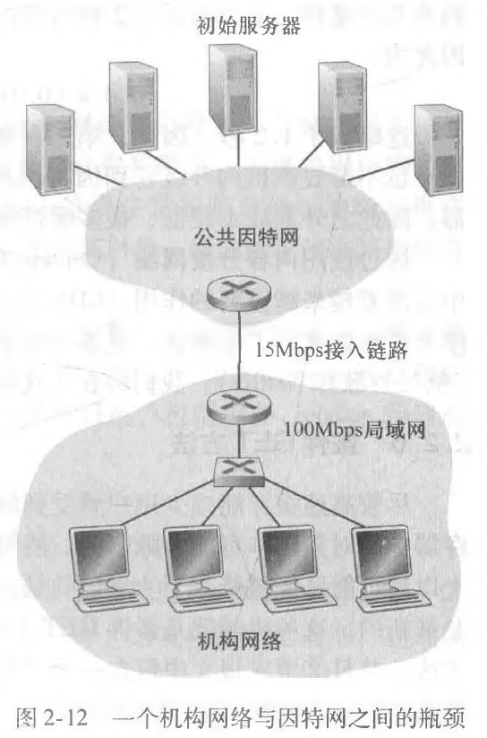

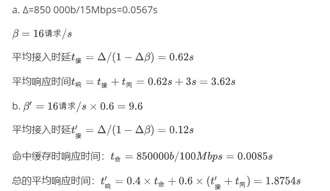

### P23

**a.什么是whois数据库？**

​	whois(“Who is”)是用来查询域名的IP以及所有者等信息的传输协议。简单说，whois就是一个用来查询域名是否已经被注册，以及注册域名的详细信息的数据库（如域名所有人、域名注册商）。

​	通过whois来实现对域名信息的查询。早期的whois查询多以命令列接口存在，但是现在出现了一些网页接口简化的线上查询工具，可以一次向不同的数据库查询。网页接口的查询工具仍然依赖whois协议向服务器发送查询请求，命令列接口的工具仍然被系统管理员广泛使用。whois通常使用TCP协议43端口。每个域名/IP的whois信息由对应的管理机构保存。

**b.使用因特网上的各种whois数据库，获得两台DNS服务器的名字。指出你使用的是哪个whois数据库。**

+ 使用cnnic（中国互联网络中心）的whois数据库查询honor.cn

  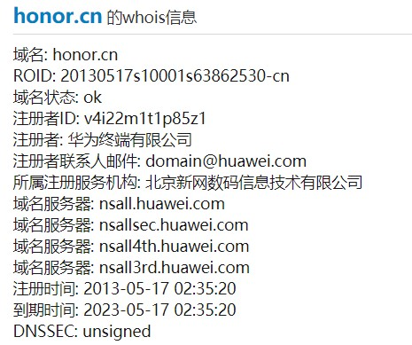

+ 使用chinaz(站长之家)的whois数据库查询aliyun.com

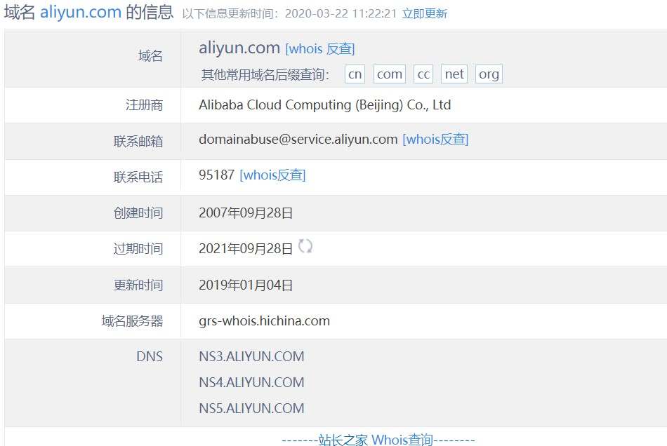

**c.你本地机器上使用nslookup向3台DNS服务器发送DNS査询：你的本地DNS服务器和两台你在 （b）中发现的DNS服务器。尝试对类型A、NS和MX报告进行查询。总结你的发现。**

​	使用三个dns服务器查询baidu.com的相关信息

+ -A 

  默认dns服务器

  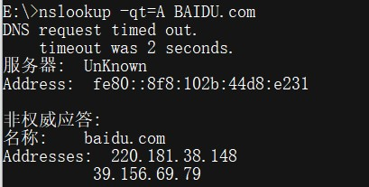

  华为dns服务器

  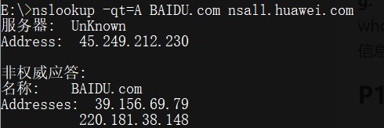

  阿里dns服务器

  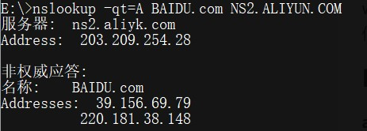

+ -NS

  默认dns服务器

  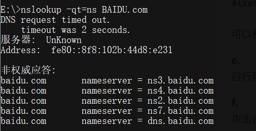

  华为dns服务器

  

  阿里dns服务器

  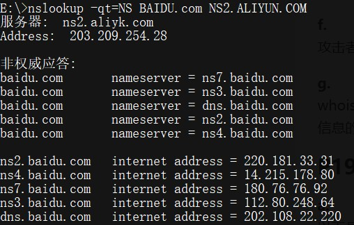

+ -MX

  默认dns服务器

  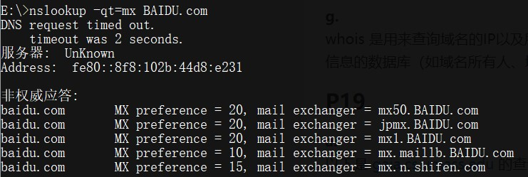

  华为dns服务器

  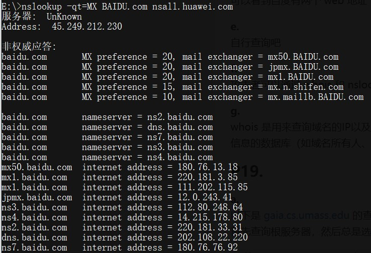

  阿里dns服务器

  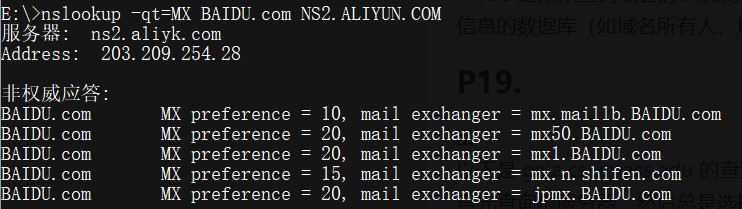

各个dns服务器获取的内容相同，具体记录的顺序存在差异。

**d.使用nslookup找出一台具有多个IP地址的Web服务器。你所在的机构（学校或公司）的Web服 务器具有多个IP地址吗？**

经查询，baidu.com具有多个ip地址

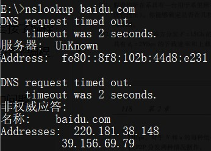

本校的的服务器也具有多个ip地址

**e.使用ARIN whois数据库，确定你所在大学使用的IP地址范围。**
**f.描述一个攻击者在发动攻击前，能够怎样利用whois数据库和nslookup IM来执行对一个机构的侦察。 **

​	攻击者可以通过 whois 和 nslookup 查询到目标的 IP 地址，DNS 服务器等

**g.讨论为什么whois数据库应当为公众所用。**

这能让互联网的使用更加清晰透明，公众通过使用whois用来查询域名是否已经被注册，以及注册域名的详细信息，可以有效降低被假冒、不良网站欺诈地风险，当受到攻击或者欺骗后也能便捷地得到攻击者的部分信息。

### P25

**考虑在一个有N个活跃对等方的覆盖网络中，每对对等方有一条活跃的TCP连接。此外，假定该 TCP连接通过总共M台路由器。在对应的覆盖网络中，有多少节点和边？**

节点：N

边：N(N-1)/2

## 课后习题-含$\LaTeX$

### P9

a. Δ=850 000b/15Mbps=0.0567s

$$\beta=16 请求/s$$

平均接入时延$t_接=\Delta/(1-\Delta\beta)=0.62s$

平均响应时间$t_响=t_接+t_网=0.62s+3s=3.62s$

b. $\beta'=16 请求/s\times0.6=9.6$

平均接入时延$t_接'=\Delta/(1-\Delta\beta)=0.12s$

命中缓存时响应时间：$t_命=850 000b/100Mbps=0.0085s$

总的平均响应时间：$t_响'=0.4\times t_命+ 0.6\times (t_接’+t_网)=1.8754s$

