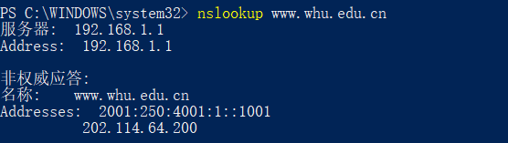

# nslookup www.whu.edu.cn

nslookup 用于查询DNS的记录，查看域名解析是否正确，在网络故障的时候用来诊断网络问题

# P7

​		1   IP地址时间：RTT1+RTT2+..+RTTn

​	    2   三次握手+最后相应：2RTT0

​        最后就是   2RTT0+RTT1+RTT2+..+RTTn

# P8

​		a:  2RTT0+RTT1+RTT2+..+RTTn+8*2RTT0=18RTT0 + RTT1 + RTT2 + … + RTTn

​        b:2RTT0 + RTT1 + RTT2 + … + RTTn + 2 * 2 RTT0 = 6 RTT0 + RTT1 + RTT2 + … + RTTn

​		c:2RTT0 + RTT1 + RTT2 + … + RTTn + RTT0 = 3 RTT0 + RTT1 + RTT2 + … + RTTn

