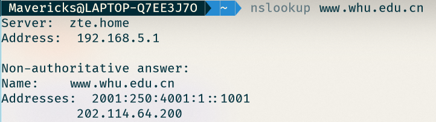
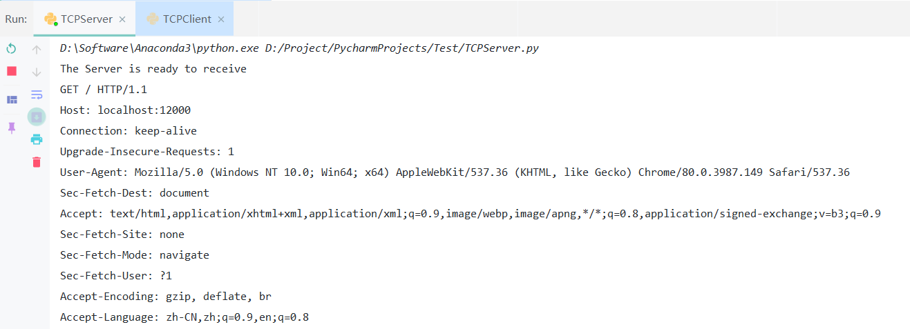
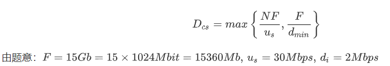
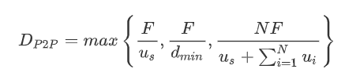

# 网络及分布式 第四次作业

[TOC]

## nslookup www.whu.edu.cn



## 课后习题

### P12

代码如下：

```python
from socket import *
serverPort = 12000
serverSocket = socket(AF_INET, SOCK_STREAM)
serverSocket.bind(('', serverPort))
serverSocket.listen(1)
print('The Server is ready to receive')
while True:
    connectionSocket, addr = serverSocket.accept()
    sentence = connectionSocket.recv(1024).decode()
    # capitalizedSentence = sentence.upper()
    # connectionSocket.send(capitalizedSentence.encode())
    print(sentence)
    connectionSocket.close()
```

在电脑上打开浏览器并输入`localhost:12000`，得到一下结果：



### P22

#### 客户-服务器分发

由所学知识可知：

LaTeX:
$$
D_{cs}=max \left\{ \frac{NF}{u_s},\frac{F}{d_{min}} \right\}
$$
由题意：$F = 15Gb = 15 \times 1024Mbit = 15360 Mb, \, u_s = 30Mbps, \, d_i = 2Mbps$

图片：



所以可得表：

|      | 300kbps | 700kbps | 2Mbps   |
| :--- | ------- | ------- | ------- |
| 10   | 7680s   | 7680s   | 7680s   |
| 100  | 51200s  | 51200s  | 51200s  |
| 1000 | 512000s | 512000s | 512000s |

#### P2P分发

由所学知识可知：
$$
D_{P2P}=max \left\{ \frac{F}{u_s}, \frac{F}{d_{min}}, \frac{NF}{u_s+\sum_{i=1}^N u_i} \right\}
$$


所以可得表：

|      | 300kbps   | 700kbps   | 2Mbps    |
| ---- | --------- | --------- | -------- |
| 10   | 7680.00s  | 7680.00s  | 7680.00s |
| 100  | 25903.56s | 15616.20s | 7680.00s |
| 1000 | 47558.78s | 21524.85s | 7680.00s |

### P27

#### a.

将N个视频版本和N个音频版本进行一一对应，例如低画质对应低音质，如此绑定起来，一共需要存储N个文件。

#### b.

如果需要分别发送，那么需要视频和音频分开存储，则需要存储N+N=2N个文件。