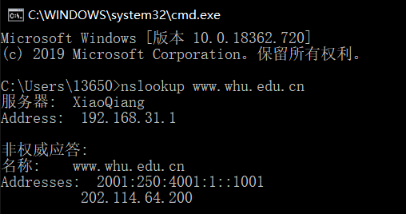

## nslookup

nslookup是一种网络管理命令行工具，可用于查询DNS域名和IP地址。输入指令nslookup默认服务器和Address是当前上网所用的DNS服务器域名和地址A。记录A（Address）记录指的是用来指定主机名或域名对应的IP记录。在提示符>后直接输入域名，可以查看该域名的A记录（也可以用set type=a指令设置）：MX记录MX（mail exchanger）记录，邮件交换记录，它指向一个邮件服务器，用于电子邮件系统发邮件时根据收信人的地址后缀来定位邮件服务器。输入set type=mx，再输入域名可查询mx类型记录MX perference = 10 指MX记录的优先级NS记录NS（nameserver）记录，用来指定改域名由那个DNS服务器来进行解析。先输入set type=ns再输入域名CNAME记录cname记录是别名记录，也成为规范名字。这种记录允许将多个名字映射到同一台计算机输入set type=cname可以查询

## P7

得到IP地址的时间 为各段时间之和：RTT1 + RTT2 + … + RTTn
三次握手加上最后的响应为：2\*RTT0
故总时长为： 2\*RTT0 + RTT1 + RTT2 + … + RTTn

## P11

a. 可以，因为并行连接使他拥有更大的链路带宽

b. 有，这样可以保证他的带宽更大

## P13

MAIL FROM 是 SMTP 握手协议的一部分，而 From 是邮件报文的一部分