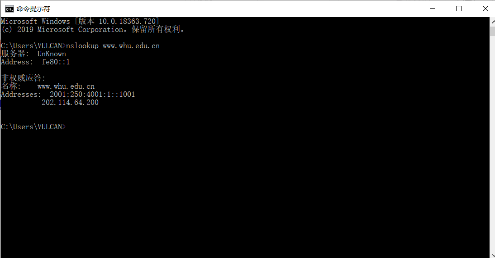

一、上机部分
nnslookup www.whu.edu.cn

二、习题部分

P13. MAIL FROM 是 SMTP 握手协议的一部分，而 From 是邮件报文的一部分。

P23. 
a.
服务器向每个客户端并行发送文件，此速率为 us/N，因为 us/N <= dmin，所以客户端也以该速率下载。则每个客户端接收完文件的时间为 F / (us / N) = NF / us
b.
服务器向每个客户端并行发送文件，以 dmin 为速率，因为 us/N >= dmin，所以 us >= Ndmin，故服务器可以承受此速率，各服务器以 dmin 为下载速率，故接收时间为 F/dmin
c.
当 us/N <= dmin 时：
        N/us >= 1/dmin
        NF/us >= F/dmin
        此时 t = NF/us = max{NF/us, F/dmin}
当 us/N >= dmin 时：
        N/us <= 1/dmin
        NF/us <= F/dmin
        此时 t = F/dmin = max{NF/us, F/dmin}
因此：得出最小分发时间为 max{NF/us，F/dmin}

P25.  有N个节点，N(N-1)/2条边。