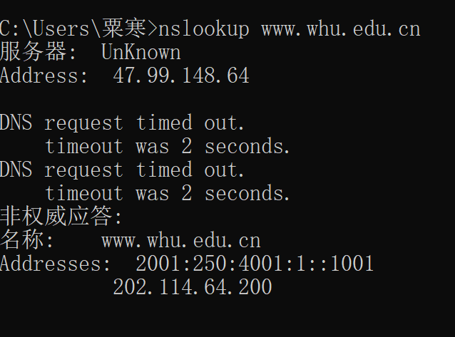

# 网络分布式作业-4
## nslookup 
```
nslookup www.whu.edu.cn
```

## 习题

* p7

    访问DNS获得IP过程产生RTT(1)=RTT1+RTT2+...+RTTN

    与服务器建立TCP连接产生RTT(2) = 2RTT0

    最终消耗时间RTT = RTT(1)+RTT(2)=2RTT0+RTT1+RTT2+...+RTTN
* p10

    忽略传播时延  
    非持续HTTP并行：  
    首个对象建立TCP连接过程传输时延 = 200*3/150 = 4s  
    对象数据分组传输时延 = 100000/150 ≈ 666.6s  
    引用对象建立TCP连接过程传输时延 = 200*3/(150/10) = 40s  
    引用对象数据分组传输时延 = 100000/(150/10) ≈ 6666.6s
    总耗时 ≈ 7377s  

    持续HTTP:  
    建立TCP连接过程传输时延 = 200*3/150 = 4s  
    对象数据分组传输时延 = 100000*11/150 ≈ 7333s  

    总结：持续HTTP比非持续HTTP并行的情况有增益但是增益幅度很小
* p22

    客户-服务分发  
    Dc-s ≥ max{NF/us, F/dmin} 故与u无关
    |  N   | t(10^3s) |
    |  --  | ------   | 
    |  10  |  75      |
    |  100 |  500     |
    | 1000 |  5000    |
    P2P分发  
    DP2P ≥  max{F/us, F/dmax, NF/(us + ∑ui)}
    |t(10^3s)| u | 300 | 700 | 2M  |
    |  ---   | - | --- | --- | --  |
    |  N     |   |     |     |     |
    |  10    |   | 7.5 | 7.5 | 7.5 |
    |  100   |   | 25  | 15  | 7.5 |
    | 1000   |   | 45.5| 20.5| 7.5 |
