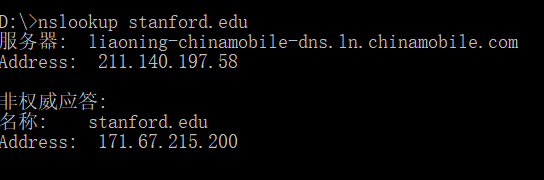
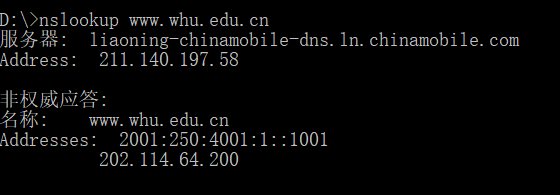

# nslookup截图

**nslookup stanford.edu**

**nslookup www.whu.edu.cn**

# 第二章习题

> **P23:**
>
> **a.**
>
> 向每个对等方以us/N的速率传输，每个对等方同时收到完整文件，时间为NF/us
> 
> **b.**
> 
> 向dmin的对等方以dmin的速度传输。向其它对等方以大于dmin的速度传输。这样其他对等方的传输时间小于F/dmin，dmin的对等方时间为F/dmin。
>
> **c.**
>
> 结合a与b，如果us/N <= dmin，此时NF/us >= F/dmin，我们选择a方式来传输。 如果us/N > dmin，此时NF/us < F/dmin，选择b方式来传输。

> **P26:**
>
> 结点 N
> 边 N(N-1)/2

> **P25:**
>
> **a.**
>
> 向每个对等方以us/N的速率传输，每个对等方同时收到完整文件，时间为NF/us
>
> **b.**
>
> 多台计算机分别加入BitTorrent，且随时通知各个计算机自己所获得的块，使多台计算机不用索取已经获得的块。最后将获得的所有块拼接起来形成完成的副本。

