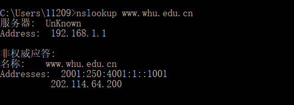

# 第四次作业

2017302580288 李沛昊

***

## 1、nslookup

使用nslookup查询www.whu.edu.cn的ip地址，得到结果如下：



## 2、课后题三道

### P22

**问题：**

考虑向N个对等方分发F = 15Gb的一个文件。该服务器具有$u_{s}= 30Mbps$的上载速率，每个对等方具有$d_{i}= 2Mbps$的下载速率和上载速率$u$。 对于$N$ = 10. 100和1000并且$u$=300kbps、700kbps和
2Mbps,对于N和u的每种组合绘制岀确定最小分发时间的图表。需要分别针对客户-服务器分发 和P2P分发两种情况制作。

**解答：**

C/S模式：

与u无关，$t_{min}=max(\frac{NF}{u_{s}},\frac{F}{d_{i}})$

| N          | 10    | 100    | 1000    |
| ---------- | ----- | ------ | ------- |
| $t_{min} $ | 7500s | 50000s | 500000s |

P2P:

$t_{min}=max(\frac{F}{u_{s}},\frac{F}{d_{i}},\frac{NF}{u_{s}+Nu})$

|           | N=10  | N=100  | N=1000   |
| --------- | ----- | ------ | -------- |
| u=300kbps | 7500s | 25000s | 45454.5s |
| 700kbps   | 7500s | 15000s | 20547.9s |
| 2Mbps     | 7500s | 7500s  | 7500s    |

### P25

**问题：**考虑在一个有N个活跃对等方的覆盖网络中，每对对等方有一条活跃的TCP连接。此外，假定该 TCP连接通过总共M台路由器。在对应的覆盖网络中，有多少节点和边？ 

**解答：** 节点数量：N，边数量：$\frac{N(N-1)}{2}$

### P29

**问题：**假定在UDPClient. py中在创建套接字后增加了下面一行： clientsocket.bind（（z z, 5432））

```python
clientsocket.bind(('',5432))
```

有必要修改UDPServer. py吗？ UDPClient和UDPServer中的套接字端口号是多少？在变化之前它们是多少？

**解答：** 没有必要修改，因为在UDP客户端发送给服务端的报文中会包括客户端的ip和端口号。客户端端口号为5432，服务端为12000。改变之前客户端端口号由操作系统底层确定，服务端端口号仍为12000.