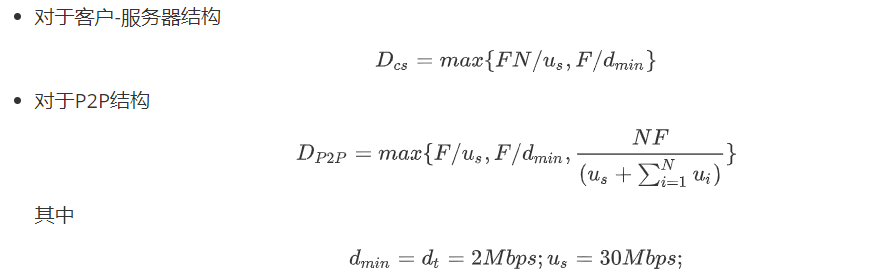
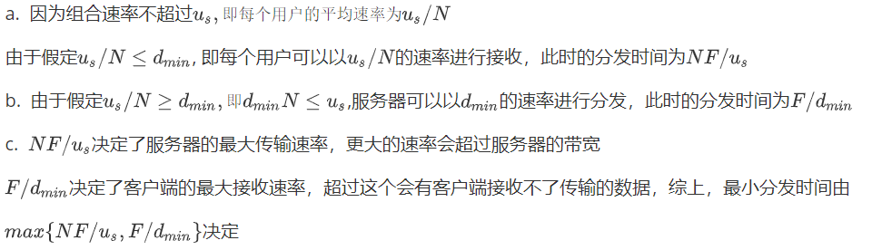
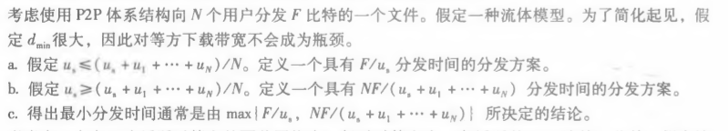
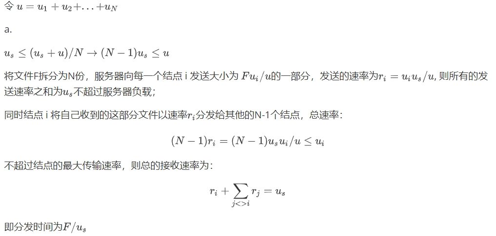
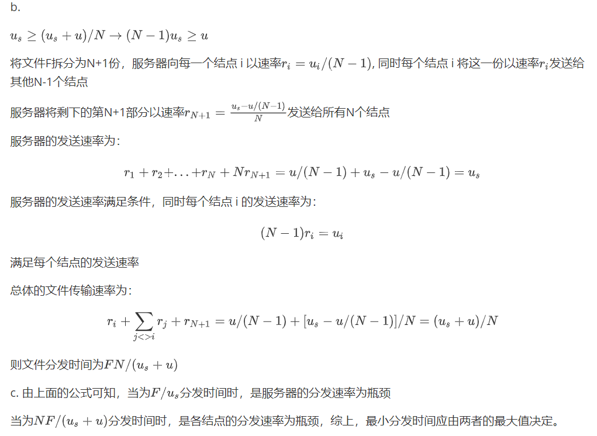

# nslookup

命令截图如下：

# 课后习题

## p22

考虑向N个对等方分发F = 15Gb的一个文件。该服务器具有$u_s$= 30Mbps的上载速率，每个对等方具有$d_t$= 2Mbps的下载速率和上载速率u. 对于N = 10、100和1000并且u=300kbps、700kbps和2Mbps,对于N和u的每种组合绘制岀确定最小分发时间的图表。需要分别针对客户-服务器分发 和P2P分发两种情况制作。 

答：

结果如下表

| 客户端-服务器 | 10      | 100      | 1000      |
| ------------- | ------- | -------- | --------- |
| 300kbps       | 7680sec | 51200sec | 512000sec |
| 700kbps       | 7680sec | 51200sec | 512000sec |
| 2Mbps         | 7680sec | 51200sec | 512000sec |

| P2P     | 10      | 100        | 1000        |
| ------- | ------- | ---------- | ----------- |
| 300kbps | 7680sec | 25600sec   | 47558.78sec |
| 700kbps | 7680sec | 15616.2sec | 21524.85sec |
| 2Mbps   | 7680sec | 7680sec    | 7680sec     |

## p23

## p24

---

**原公式**

p22
- 对于客户-服务器结构
$$
D_{cs} = max\{FN/u_s , F/d_{min} \}
$$

- 对于P2P结构
$$
D_{P2P} = max \{ F/u_s , F/d_{min} , \frac{NF}{(u_s + \sum^{N}_{i=1} u_i)}\}
$$
其中

$$
d_{min}= d_t = 2Mbps; u_s = 30Mbps;
$$
---

p23

a.因为组合速率不超过$u_s,即每个用户的平均速率为 u_s/N$

由于假定$u_s/N \le d_{min}$, 即每个用户可以以$u_s/N$的速率进行接收，此时的分发时间为$NF/u_s$

b.  由于假定$u_s/N \ge d_{min}, 即 d_{min}N \le u_s$,服务器可以以$d_{min}$的速率进行分发，此时的分发时间为$F/d_{min}$

c. 
$NF/u_s$决定了服务器的最大传输速率，更大的速率会超过服务器的带宽
$F/d_{min}$决定了客户端的最大接收速率，超过这个会有客户端接收不了传输的数据，综上，最小分发时间由$max\{ NF/u_s, F/d_{min}\}$决定

---

p24
令$u = u_1 + u_2 + ... + u_N$

a.  

$u_s \le (u_s + u)/N \rightarrow (N-1)u_s \le u$

将文件F拆分为N份，服务器向每一个结点 i 发送大小为 $Fu_i/u$的一部分，发送的速率为$r_i = u_i u_s /u$, 则所有的发送速率之和为$u_s$不超过服务器负载；

同时结点 i 将自己收到的这部分文件以速率$r_i$分发给其他的N-1个结点，总速率：
$$
(N-1)r_i=(N-1)u_s u_i/u\le u_i
$$
不超过结点的最大传输速率，则总的接收速率为：
$$
r_i + \sum_{j<>i}r_j = u_s
$$
即分发时间为$F/u_s$

b.

$u_s \ge (u_s + u)/N \rightarrow (N-1)u_s \ge u $

将文件F拆分为N+1份，服务器向每一个结点 i 以速率$r_i = u_i/(N-1)$, 同时每个结点 i 将这一份以速率$r_i$发送给其他N-1个结点

服务器将剩下的第N+1部分以速率$r_{N+1} = \frac{u_s-u/(N-1)}{N}$发送给所有N个结点

服务器的发送速率为：
$$
r_1 + r_2 +...+r_N + N r_{N+1}=u/(N-1)+u_s-u/(N-1) = u_s
$$
服务器的发送速率满足条件，同时每个结点 i 的发送速率为：
$$
(N-1)r_i = u_i
$$
满足每个结点的发送速率

总体的文件传输速率为：
$$
r_i + \sum_{j<>i}r_j +r_{N+1} = u/(N-1)+[u_s-u/(N-1)]/N = (u_s+u)/N
$$
则文件分发时间为$FN/(u_s+u)$

c. 由上面的公式可知，当为$F/u_s$分发时间时，是服务器的分发速率为瓶颈

当为$NF/(u_s+u)$分发时间时，是各结点的分发速率为瓶颈，综上，最小分发时间应由两者的最大值决定。
