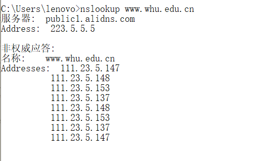
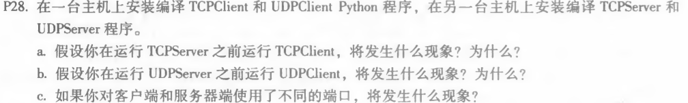

## nslookup  www.whu.edu.cn

## P23
 

a.向每个对等方以us/N的速率传输，同样的传输速率下每个对等方同时收到完整文件，时间为NF/us 
b.向dmin的对等方以dmin的速率传输，其他对等方的传输速率大于dmin，dmin的对等方时间为F/dmin,其他对等方时间小于F/dmin 
c.结合a和b，如果us/N≤dmin时NF/us≥F/dmin,此时选择a的方案；如果us/N>dmin时NF/us<<F/dmin,此时选择b的方案。 

## P25

共N个节点，N(N-1)/2条边

## P28

a.先运行TCPClient时，客户端无法与服务器端的程序建立连接，无法进行TCP连接，运行出错。 
b.UDPClient无需握手，程序正常运行。 
c.若干使用不同的端口，则客户端将尝试建立TCP连接，可能连接错误或不存在的进程，出现错误。 

 
刘涛 2017302580292 2020.03.23
