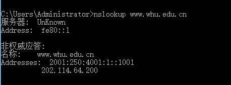
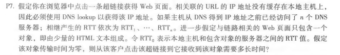
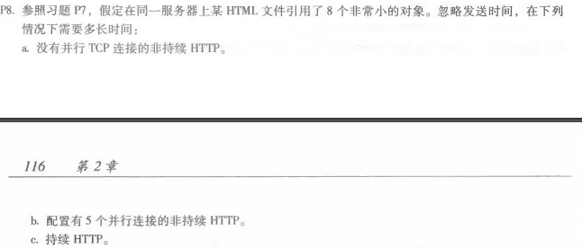
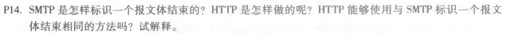

# 第四次作业
## 刘洋 2017302580294
nslookup: 
P7: 
IP地址的时间 = RTT1 + RTT2 + … + RTTn 
三次握手加上最后的响应 = 2RTT0 
总共T = 2RTT0 + RTT1 + RTT2 + … + RTTn 
P8: 
(a)、T = 2RTT0 + RTT1 + RTT2 + … + RTTn + 8 * 2 RTT0 = 18 RTT0 + RTT1 + RTT2 + … + RTTn 
(b)、T = 2RTT0 + RTT1 + RTT2 + … + RTTn + 2 * 2 RTT0 = 6 RTT0 + RTT1 + RTT2 + … + RTTn 
(c)、T = 2RTT0 + RTT1 + RTT2 + … + RTTn + RTT0 = 3 RTT0 + RTT1 + RTT2 + … + RTTn
P14: 
SMTP使用仅包含一个句号的一行来标志报文体结束 
HTTP使用Content-Length来表示消息正文的长度 
不能，因为内容中可能含有句号。