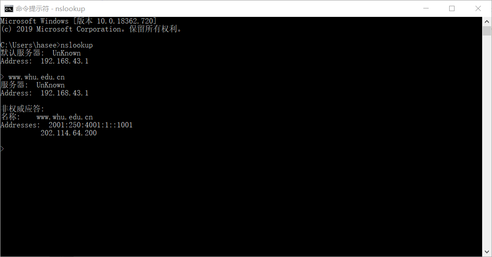
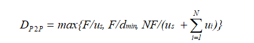
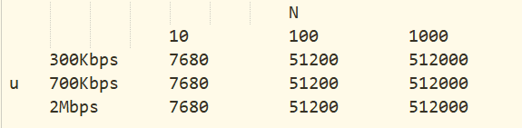
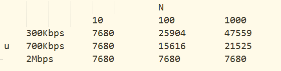

# 网络及分布式计算第四次作业
## 1、nslookup查询实验
答：nslookup是域名查询命令，可以在linux和windows平台上查询域名对应的iP地址。nslookup可以指定查询的类型，可以查到DNS记录的生存时间还可以指定使用那个DNS服务器进行解释。在已安装TCP/IP协议的电脑上面均可以使用这个命令。主要用来诊断域名系统 (DNS) 基础结构的信息。

## 2、课本第二章习题
### P11
答：a) 可以，因为Bob有更多的连接数，他可以获得更大的链路带宽。
### 
b) 是的，Bob仍然需要执行并行下载；否则他将获得比其他四个用户更少的带宽。
### P13
答：SMTP中的MAIL FROM是SMTP握手协议的一部分，而该邮件报文自身中的From是邮件报文的一部分。
### P22
答：依题意，客户-服务器分发的最小分发时间可以用以下公式获得，
### 
Dcs=max{NF/us,F/dmin}
### 
同理，P2P分发的最小分发时间可以用以下公式获得，
### 

### 
所以，代入具体数字F=15Gb=15*1024Mbits，us=30Mbps，dmin=di=2Mbps。所以最小分发时间表如下：
### 
客户-服务器分发
### 

### 
P2P分发
### 
