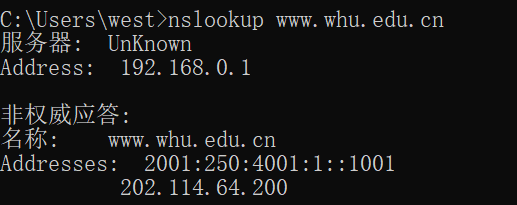
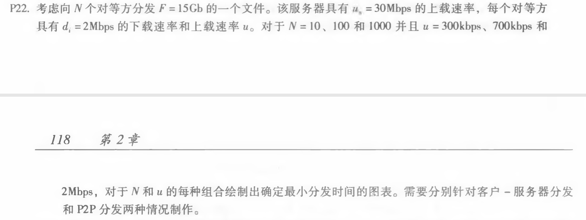
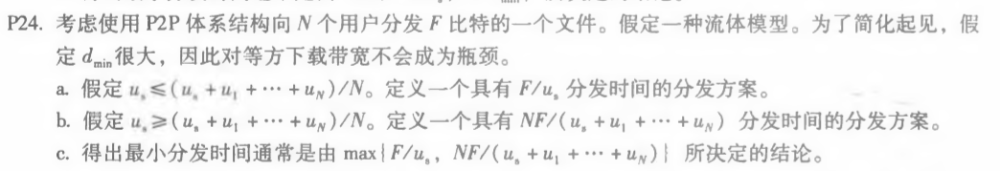

#### 1. nslookup

nsloookup用于查询DNS的记录，查看域名解析是否正常，在网络故障的时候用来诊断网络问题。

用法为

```
nslookup –d [其他参数] domain [dns-server]
```

nslookup www.whu.edu.cn 截图




#### 2. P22



对于采用客户-服务器分发，有：
$$
D_{cs} = max\{\frac{NF}{u_s}, \frac{F}{d_{min}}\}
$$
得到图表为

| u\N | 10 | 100 | 1000|
| ---- | ---- | ---- | ---- |
|300 kbps | 7680 | 51200 | 512000 |
|700 kbps | 7680 | 51200 | 512000 |
|2 Mbps | 7680 | 51200 | 512000 |


对于采用P2P分发，有：
$$
D_{P2P} = max\{\frac{F}{u_s}, \frac{F}{d_{min}}, \frac{NF}{u_s + \sum_{i=1}^N{u_i}} \}
$$
得到图表为

| u\N      | 10   | 100   | 1000  |
| -------- | ---- | ----- | ----- |
| 300 kbps | 7680 | 25904 | 27559 |
| 700 kbps | 7680 | 15616 | 21525 |
| 2 Mbps   | 7680 | 7680  | 7680  |


#### 3. P23


对于采用客户-服务器分发，由于
$$
D_{cs} = max\{\frac{NF}{u_s}, \frac{F}{d_{min}}\}
$$
a. 如果 $ u_s/N \le d_{min} $  ，那么有 $ D_ {cs} = \frac{F}{d_{min}}$，当服务器以 $\frac{u_s}{N}$的速度向每个客户端同时发送文件时，发送速率小于接收速率，得到分发时间为 $F / (\frac{u_s}{N}) = NF/u_s $

b. 如果 $ u_s/N \ge d_{min} $  ，那么有 $ D_ {cs} = \frac{NF}{u_s}$，当服务器以 $d_{min}$的速度向每个客户端同时发送文件时，此时客户端的接收速度为$d_{min}$，接收速率小于发送速率，得到分发时间为 $F /d_{min} $

c. 当 $ u_s/N \le d_{min} $ 时，最小分发时间为 $ NF/u_s $

​    当$ u_s/N \ge d_{min} $  时，最小分发时间为$F /d_{min}$


#### 3. P24



对于采用P2P结构体系分发，由于

$$
D_{P2P} = max\{\frac{F}{u_s}, \frac{F}{d_{min}}, \frac{NF}{u_s + \sum_{i=1}^N{u_i}} \}
$$

因为$d_{min}$很大，那么$\frac{F}{d_{min}}$很小，可认为$ D_{P2P} = max\{\frac{F}{u_s}, \frac{NF}{u_s + \sum_{i=1}^N{u_i}} \}$

a. 如果$u_s \le (u_s + \sum_{i=1}^N)/N$，那么有$ D_{P2P} = \frac{F}{u_s}$，此时接收速率为$u_s$，分发时间为$ \frac{F}{u_s}$

b. 如果$u_s \ge (u_s + \sum_{i=1}^N)/N$，那么有$ D_{P2P} = \frac{NF}{u_s + \sum_{i=1}^N{u_i}} $，此时接收速率为$(u_s + \sum_{i=1}^N)/N$，分发时间为$\frac{NF}{u_s + \sum_{i=1}^N{u_i}}$

c. 当$u_s \le (u_s + \sum_{i=1}^N)/N$，最小分发时间为$ \frac{F}{u_s}$

   当$u_s \ge (u_s + \sum_{i=1}^N)/N$，最小分发时间为$\frac{NF}{u_s + \sum_{i=1}^N{u_i}} $

