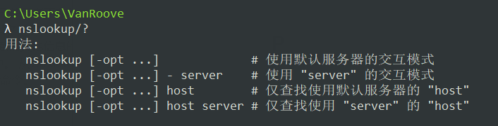
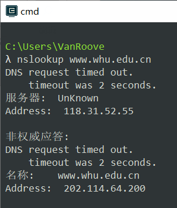

# 第二章练习题

## P10

分组在链路里的传播时间$T_{prop} = 10 \div (3\times10^{8}) \approx 3.3\times10^{-8} s$；

在本题中应该时首先请求一个下载对象，然后再请求十个引用对象；

首先我们计算在使用非持续连接的并行下载时，对于请求十个引用对象使用并行连接，其中每个连接的带宽为$15bps$，完成接受所有文件总耗时为：

$$ T_{非持续} = (200/150+T_{prop}+200/150+T_{prop}+200/150+T_{prop}+100000/150+T_{prop}) + (200/15+T_{prop}+200/15+T_{prop}+200/15+T_{prop}+100000/15+T_{prop}) \approx 7377(s)+T_{prop}$$

对于持续连接，在开始请求下载对象建立的连接为串行连接，所以在之后的十个引用请求时也时串行进行，完成接受所有文件总耗时为：

$$T_{持续} = 200/150+T_{prop}+200/150+T_{prop}+200/150+T_{prop}+100000/150+T_{prop}) + 10\times(200/150+T_{prop}+100000/150+T_{prop}) \approx 7351(s) + 24T_{prop}$$

由于传播时间$T_{prop}$的数量级很小，对结果的判断不会产生影响，我们可以暂时丢弃。所以可以得到持续的HTTP连接能够节省的时间$T_{节省} = T_{非持续} - T_{持续} = 26s$，其在总时间占比不到$1\%$，所以使用持续的HTTP比非持续情况并没有很大的增益。

## P23

**a.** 根据题中条件$u_{s}/N \le d_{min}$，即若采用服务器以$u_{s}/N$的速率并行向$N$个端系统发送文件，每个端系统的下载速率都大于$u_{s}/N$，因此每个端系统都可以以$u_{s}/N$的速率下载文件。从文件传输开始至$NF/u_{s}$时，所有客户端都接受到了该文件。

**b.** 根据题中条件$u_{s}/N \ge d_{min}$，当服务器以$d_{min}$的速率并行向$N$个客户端发送文件，且每个客户端以$d_{min}$的速率下载文件时，发布时间为$F/d_{min}$。此时服务器的组合速率为$Nd_{min} \le u_{s}$，满足条件。

**c.** 从课本中的结论我们得知，客户-服务器体系的最小分发时间：

$$D_{cs} \geqslant max \{ \frac{NF}{u_{s}},\frac{F}{d_{min}} \}$$

由a题可知，当$u_{s}/N \le d_{min}$即$max \{ \frac{NF}{u_{s}},\frac{F}{d_{min}} \} = NF/u_{s}$时，存在分发时间为$NF/u_{s}$的分发方案；

由b题可知，当$u_{s}/N \ge d_{min}$即$max \{ \frac{NF}{u_{s}},\frac{F}{d_{min}} \} = F/d_{min}$时，存在的分发时间为$F/d_{min}$的分发方案；

故$D_{cs} = max \{ \frac{NF}{u_{s}},\frac{F}{d_{min}} \}$总是成立的，即最小发布时间由$max \{ \frac{NF}{u_{s}},\frac{F}{d_{min}} \}$决定。

## P24

**a.** 设$u_{total} = u_{1}+u_{2}+\cdots+u_{N}$，定义一个这样的分发方案：

服务器中将文件分为$N$份，其中第$i$份的大小为$u_{i}F/u_{total}$，然后将第$i$份以$u_{i}u_{s}/u_{total}$的速率发向第$i$个客户端，此时服务器的组合速为$u_{s}$，满足条件。服务器同时传送完文件的$N$份所用时间为$F/u_{s}$。

对于第$i$个客户端，以$u_{i}/(N-1)$的速率将其接受到文件的比特发送给其他$N-1$个客户端。此时对于第$i$个客户端，其向其他所有客户端传输完文件的第$i$份所有时间为$F(N-1)/u_{total}$，由$u_{s} \leqslant (u_{s}+u_{total})/N$可得，$F(N-1)/u_{total} \leqslant F/u_{s}$。

对于每个客户端向其他$N-1$个客户端发送完文件所有时间都为$F(N-1)/u_{total}$，小于服务器同时传送完文件的$N$份所用时间为$F/u_{s}$，同时在$F/u_{s}$时对于每个客户端都成功接受到了完整的文件。

**b.** 设$u_{total} = u_{1}+u_{2}+\cdots+u_{N}$，定义一个这样的分发方案：

服务器中将文件分为$N$份，其中第$i$份的大小为$u_{i}F/(u_{s}+u_{total})$，然后将第$i$份以$u_{i}/N$的速率发向第$i$个客户端，此时服务器的组合速为$u_{total}/N \leqslant u_{s}$，满足条件。服务器同时传送完文件的$N$份所用时间为$NF/(u_{s}+u_{total})$。

对于第$i$个客户端，以$u_{i}/(N-1)$的速率将其接受到文件的比特发送给其他$N-1$个客户端。此时对于第$i$个客户端，其向其他所有客户端传输完文件的第$i$份所有时间为$F(N-1)/(u_{s}+u_{total}) < NF/(u_{s}+u_{total})$。

因此在时间$NF/(u_{s}+u_{total})$时，对于每个客户端都已经接收到了文件的$N$份，完成了分发。

**c.** 从课本的结论我们得知，P2P体系的最小分发时间：

$$D_{P2P} \geqslant max\{ \frac{F}{u_{s}},\frac{F}{d_{min}},\frac{NF}{u_{s}+\sum_{i=1}^{N}u_{i}} \}$$

由于题中说$d_{min}$下载带宽不会成为瓶颈，故$D_{P2P} \geqslant max \{ \frac{F}{u_{s}},\frac{NF}{u_{s}+\sum_{i=1}^{N}u_{i}} \}$；

由a题可知，当$u_{s} \leqslant (u_{s}+u_{1}+\cdots+u_{N})/N$即$\frac{F}{u_{s}} \geqslant \frac{NF}{u_{s}+\sum_{i=1}^{N}u_{i}}$时，存在分发时间为$\frac{F}{u_{s}}$的分发方案；

由b题可知，当$u_{s} \geqslant (u_{s}+u_{1}+\cdots+u_{N})/N$即$\frac{F}{u_{s}} \leqslant \frac{NF}{u_{s}+\sum_{i=1}^{N}u_{i}}$时，存在分发时间为$\frac{NF}{u_{s}+\sum_{i=1}^{N}u_{i}}$的分发方案；

故最小分发时间$D_{P2P}=max \{ \frac{F}{u_{s}},\frac{NF}{u_{s}+\sum_{i=1}^{N}u_{i}} \}$总是成立的，即最小分发时间由$max \{ \frac{F}{u_{s}},\frac{NF}{u_{s}+\sum_{i=1}^{N}u_{i}} \}$所决定。

## nslookup

nslookup (name server lookup)，命令用于**查询DNS的记录**，**查看域名解析是否正常**，**在网络故障的时候用来诊断网络问题**。用法为：

对于命令的操作`opt`，有：`nslookup -qt=type`。其中`type`的类型可以为以下等等。

| type  |      释意      |
| :---: | :------------: |
|   A   |    地址记录    |
|  MX   | 邮件服务器记录 |
|  NS   | 名字服务器记录 |
| CNAME |    别名记录    |

对武汉大学网站域名的DNS查询结果为：

