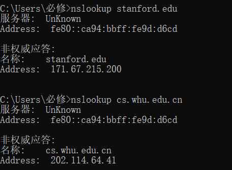

# HOMEWORK_4
- nslookup操作  
    
- P9
  - a. $Δ=850000/15Mbps=0.567s$  
       $β = 16请求/s$  
       平均接入时延：$t_{接}=Δ/(1-Δβ)=0.61s$  
       局域网时延较小忽略不计  
       因特网时延：$t_{因}=3s$  
       故总的平均响应时间：$t=t_{接}+t_{因}=3.61s$  
  - b. 60%由浏览器满足，∴$β^{`} = 16*0.6=9.6请求/s$  
       40%由cache满足，$t_{接}=Δ/(1-Δβ)=0.12s$，当使用cache时：$t_{cache}=850000/100Mbps=0.0085s$  
       ∴$t_{all}=(t_{接}+t_{因})*0.6+t_{cache}*0.4=1.8754s$
- P10   
    非持续HTTP并行：$t_{1}=2RTT+t_{文件传输}=(200b/150bps)*3 + (100Kb/ 150bps) + (200b / (150bps / 10)) * 3 + (100Kb / (150bps / 10)) = 7377.3s$  
    持续http：$t_{2}=(200b / 150bps) * 3 + (100Kb / 150bps) + 10 * (200b/150bps + 100Kb/150bps) = 7351s$  
    发现持续http没有比非持续http并行快多少，收益不大，链路短忽略传播时延，相当于只节约了报文的第二次传播时间，而报文很小，即便只在15bps的带宽下也能快速传完。
- P22  
    客户端-服务器：$t≥max\{NF/u_{s},F/d_{i}\}$，可以发现与u无关，di已知为2Mbps  
    N | t  
    -|-|-
    10 | 7500s |
    100 | 50000s |
    1000 | 500000s |   
    P2P：$t≥max\{F/u_{s},F/d_{max},NF/(u_{s}+\sum{u_{i}})\}$  
    t | N=10|N=100|N=1000
    -|-|-|-
    u=300kbps | 7500s | 25000s | 45454.5s |
    u=700kbps | 7500s | 15000s | 20547.9s |
    u=2Mbps | 7500s | 7500s | 7500s |
