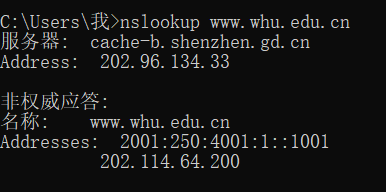

# 第四次作业

2017312580048	 徐意

## nslookup

## 课后练习题

##### P22.考虑向N个对等方分发F = 15Gb的一个文件。该服务器具有us= 30Mbps的上载速率，每个对等方 具有di= 2Mbps的下载速率和上载速率u。对于N = 10，100和1000并且u=300kbps，700kbps和2Mbps，对于N和u 每种组合绘制岀确定最小分发时间的图表。需要分别针对客户-服务器分发和P2P分发两种情况制作。

C/S分发：
$$
Dcs=\max\{NF/us,F/dmin\}
$$

|  N   | Dcs(s) |
| :--: | :----: |
|  10  |  7500  |
| 100  | 50000  |
| 1000 | 500000 |

P2P分发：
$$
Dp2p=\max\{F/us,F/dmin,NF/(us+∑u)\}
$$

|   N/t    |  10   |  100   |   1000   |
| :------: | :---: | :----: | :------: |
| 300kbps  | 7500s | 25000s | 45454.5s |
| 7000kbps | 7500s | 15000s | 20547.9s |
|  2Mbps   | 7500s | 7500s  |  7500s   |

##### P23.考虑使用一种客户-服务器体系结构向N个对等方分发一个F比特的文件。假定一种某服务器能够同时向多个对等方传输的流体模型，只要组合速率不超过叫us，则以不同的速率向每个对等方传输。 

##### a. 假定us/N<=dmin，定义一个具有NF/us分发时间的分发方案。 

##### b. 假定us/N>=dmin，定义一个具有F/dmin分发时间的分发方案。 

##### c. 得出最小分发时间通常是 max{ NF/us, F/dmin }所决定的结论。

a. 总共传输NF大的文件，服务器上载速率为us，至少要NF/us的时间。而us/N<=dmin，客户端也能承受该速度。

b. us/N>=dmin，客户端不能接受us/N的速度，所以服务器以dmin为下载速率，分发时间为F/dmin。

c. 由上两题：

us/N<=dmin时，NF/us>=F/dmin，此时Dcs=NF/us。

us/N>=dmin时，NF/us>=F/dmin，此时Dcs=F/dmin。

所以Dcs=max{NF/us,F/dmin}

##### P24.考虑使 P2P体系结构向N个用户分发F比特的一个文件。假定一种流体模型。为了简化起见 假定dmin很大，因此对等方下载带宽不会成为瓶颈。

##### a. 假定us<=(us+∑u)/N，定义一个具有F/us分发时间的分发方案。 

##### b. 假定us>=(us+∑u)/N，定义一个具有NF/(us+∑u)分发时间的分发方案。 

##### c. 得出最小分发时间通常是 max{ F/us, NF/(us+∑u) }所决定的结论。

a. 服务器至少为链路发送该文件一次，时间至少是F/us。而系统整体需要传输NF大的文件，整体速率是us+∑u，至少需要时间NF/(us+∑u)。所以us<=(us+∑u)/N时，时间F/us>=NF/(us+∑u)，分发时间是F/us。

b. us>=(us+∑u)/N时，时间F/us<=NF/(us+∑u)，分发时间是NF/(us+∑u)。

c.由上两题：

us<=(us+∑u)/N时，F/us>=NF/(us+∑u)，此时Dp2p=F/us。

us>=(us+∑u)/N时，F/us<=NF/(us+∑u)，此时Dp2p=NF/(us+∑u)。

所以Dcs=max{F/us,NF/(us+∑u)}
